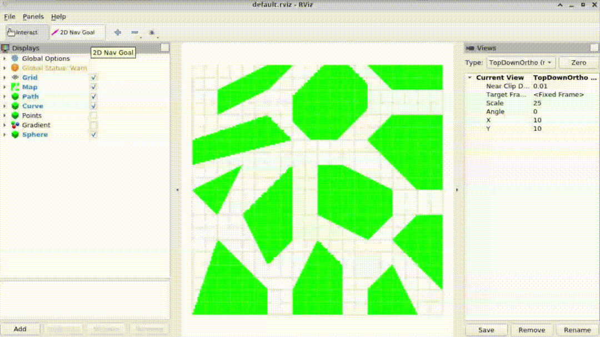

# CoTiMo Planner

### Collision-Free Smooth Path Generation + Time Optimal Path Parameterization + Model Predictive Control

  

## Reference

- D. Verscheure, B. Demeulenaere, J. Swevers, J. De Schutter, and M. Diehl, “Time-Optimal Path Tracking for Robots: A Convex Optimization Approach,” _IEEE Trans. Automat. Contr._, vol. 54, no. 10, pp. 2318–2327, Oct. 2009, doi: [10.1109/TAC.2009.2028959](https://doi.org/10.1109/TAC.2009.2028959).
- [github.com/ZJU-FAST-Lab/SDQP](https://github.com/ZJU-FAST-Lab/SDQP)
- [github.com/ZJU-FAST-Lab/LBFGS-Lite/](https://github.com/ZJU-FAST-Lab/LBFGS-Lite/)
